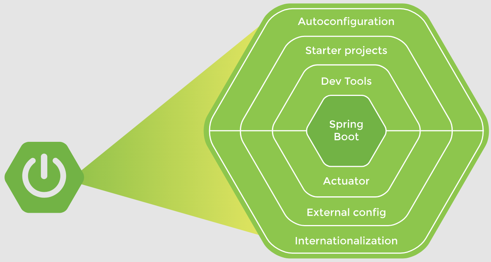
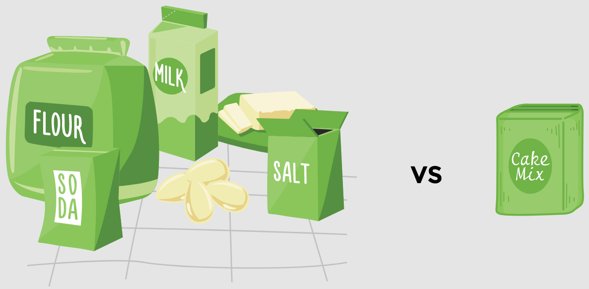

# Lesson 1: What is Spring Boot?

## Overview

Spring boot enables robust creation of applications. It provides features like servers, metrics, heath checks, etc. Spring Boot allows for integration with many servers, but by itself, it is neither an application server nor a web server. Autoconfiguration is a great feature of Spring Boot whereby it provides all the required dependencies to start a particular project.

The main features of Spring Boot are shown below:

## Demonstrated Concepts

### Spring Boot autoconfiguration

Spring Boot takes care of the configuration part for us so we can focus on developing the business logic. Spring Boot saves the time spent on creating a Spring application from scratch. An analogy of Spring and Spring Boot is shown below:

### Starter projects

Spring Boot offers starter projects which have a set of predefined dependencies. These dependencies are automatically provided to the project to simplify the build configuration.

- __Starter web__ is the preferred starter for building web applications, including RESTful applications, using Spring MVC.
- __Starter test__ is the starter dependency for testing Spring Boot applications with libraries including JUnit Jupiter, Hamcrest, and Mockito.
- __Starter JPA__ is another frequently-used starter project, which is the interface for the Hibernate framework.