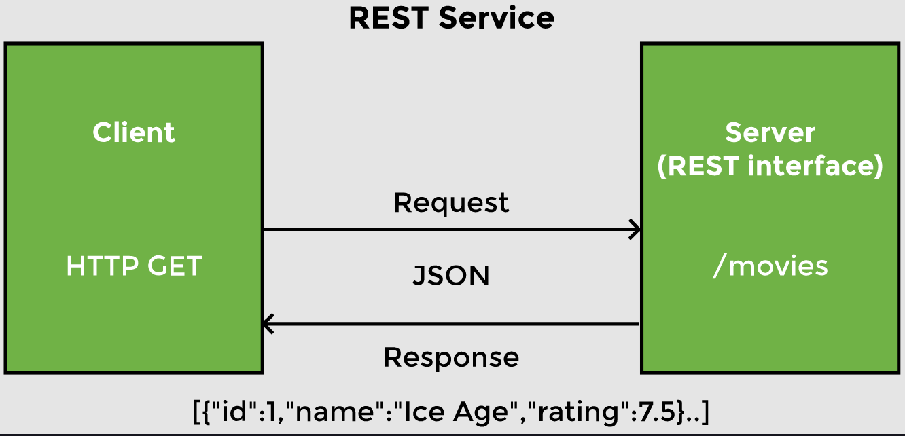
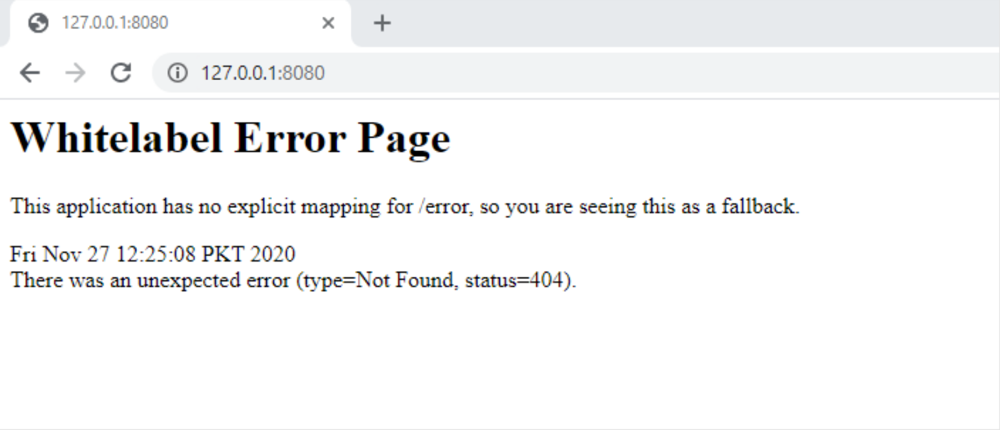

# Lesson 2: Creating a REST Service

## Overview

In this lesson, we create a REST service using Spring Boot. We define a controller for movie recommendations to return a few hard coded values when the URI `http://localhost:8080/movies` is accessed. The HTTP `Get` request for this URI will be mapped to a controller method which returns a JSON response.



## Demonstrated Concepts

### Spring Initializr

There are numerous ways of creating a Spring Boot application. The easiest way is using the web UI called Spring Initializr. Other approaches include using the Spring Boot command line interface (CLI) and the Spring Tools Suite (STS) IDE.

The Spring Initializr offers a way to bootstrap a Spring Boot application by offering a set of options to choose from. These are called starter projects which make it very easy to develop applications. Since we want to develop a simple REST service, we need the __web starter__. We will fill the form on [start.spring.io](http://start.spring.io/) and then click `Add Dependencies` and choose the `Spring Web` dependency from the web section. Finally, click on the `Generate` button and once the project is downloaded, unzip and import the project in your IDE.

Spring Boot provides us with an embedded server. If we open the application and run it, the log says:

```
Tomcat started on port 8080
```

If we want to verify that the server is running, we can go to the web browser and type `http://localhost:8080` or `http://127.0.0.1:8080`. We will get an error from the Tomcat servlet container saying there is no mapping for `/error` defined. This is because we have not provided any mapping for localhost.



### `@RestController`

The `RecommendationsController` class uses an annotation `@RestController` to inform Spring that it is a controller class. 

A controller is a Java class that maps a URI to a method. When the method is executed, it returns a response. A `@RestController` is a specialized form of `@Controller` annotation which handles REST requests and responses. It automatically handles conversion to JSON.

```java
import org.springframework.web.bind.annotation.RestController;

@RestController
public class RecommendationsController {
    //method to return all movies
}
```

### Mapping requests

The controller has the getter method to get a list of all movies i.e. `getAllMovies`. Now we need to inform Spring to execute the method when the HTTP request is received. The `@RequestMapping` annotation maps the HTTP request and URI to a method in the controller. Since we are currently handling a GET request, we can also use the shortcut annotation `@GetMapping` on the `getAllMovies` method.

```java
@RequestMapping(method=RequestMethod.GET, value="/movies")
//OR
@GetMapping("/movies")
public List<Movie> getAllMovies() {
    //...
}
```

The `@GetMapping` annotation will map the `/movies` URI to the `getAllMovies` method and convert the list of movies returned by the method to a JSON response.

By following these simple steps, our REST controller is ready. If you are running this application in your IDE, after executing it, head over to the browser and type `localhost:8080/movies` or `http://127.0.0.1:8080/movies` in your browser. The server will respond back with a JSON response of the recommended movies.

To be able to run the application again in an IDE, we need to kill the application to free up port 8080.

### What happens behind the scene?

We focused on the logic of creating a controller while the infrastructure was taken care of by Spring Boot. All the things needed for the REST service to function were configured automatically.

- `@SpringBootApplication` annotation defines a configuration and enables a component scan. The dispatcher servlet gets initialized without us having to configure it.

- During component scan, all classes marked with different `@Component` annotations are picked up by Spring. The class marked with `@RestController` annotation is picked up and `RecommendationsController` is listed as a component.

- Tomcat server is autoconfigured in our application. There is no need to download and install the server. There are some servlet container configurations that may be needed on Tomcat to run our application. Spring Boot makes those servlet container configurations a part of our application which makes it a standalone application.

- In the `RecommendationsController` class, we are returning an array back which is automatically converted into a JSON response. The starter-json dependency causes the JSON binding.

- `spring-boot-autoconfigure` is listed as a dependency in the Maven Dependencies folder which has a lot of classes. At startup, Spring Boot triggers this JAR which looks through classes on the classpath. If we turn the debug mode on in the `application.properties` file, we will be able to see a detailed autoconfiguration report.

    ```properties
    logging.level.org.springframework = DEBUG
    ```

  This report mentions all the beans that have been configured due to conditional matching (positive matches). It also shows all the things that were not autoconfigured (negative matches) and why certain beans were not created.

  In order to see this autoconfiguration report from the output log in your IDE, open the output log and search for `CONDITIONS EVALUATION REPORT`.