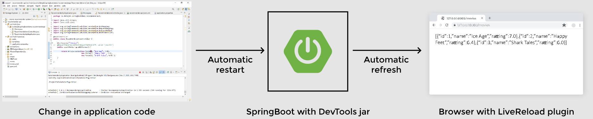

# Lesson 3: Developer Tools

## Demonstrated Concepts

### devtools dependency
Spring Boot offers a __Developer Tool__ that supports live reloads. This jar is provided by the Spring Boot framework and is useful for development-specific debugging. To use developer tools, add the following dependency to `pom.xml` file:

```xml
<dependency>
    <groupId>org.springframework.boot</groupId>
    <artifactId>spring-boot-devtools</artifactId>
</dependency>
```

If the scope of this dependency is limited to runtime using the tag `<scope>runtime</scope>` it will not be packaged in the jar.

When the dependency is downloaded, we can execute the project again. From this point on, any change in the code will be picked up by the server without the need to stop and restart the server.

### Automatic restart

Automatic restart of the application is an important feature of __DevTools__. Whenever any change is made to the code, __DevTools__ causes an automatic restart when a file on its classpath changes. Spring Boot provides two classloaders: one for the classes that do not change like third-party jars and the other for application code using the `RestartClassLoader`. When the code is changed, only the `RestartClassLoader` is loaded, which causes the restart to be much faster.



### LiveReload server

To save the time wasted in refreshing the browser after every code change, Spring Boot comes with a `LiveReload` embedded server which triggers an automatic browser refresh. The `LiveReload` extensions are available for different browsers. Once installed and enabled, any change in the code is detected by the `LiveReload` server and the browser is automatically refreshed to reflect the change.