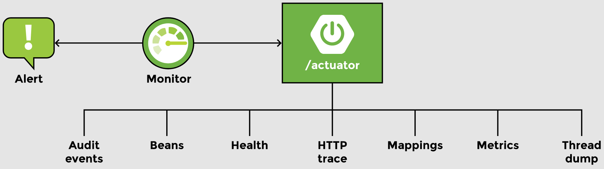

# Lesson 4: Actuator

## Overview

Spring Boot Actuator is a feature that provides monitoring features for the application during development and after deployment. It provides metadata about the application like the beans configured, how autoconfiguration has worked, how many times a specific service is called, how many times a specific service has failed, etc.



## Demonstrated Concepts

### Actuator dependency

The Actuator module can be enabled while creating a Spring Boot application by adding the Actuator dependency from the Ops section. For an application that is already running, `spring-boot-starter-actuator` can be added to the `pom.xml` file as follows:

```xml
<dependency>
    <groupId>org.springframework.boot</groupId>
    <artifactId>spring-boot-starter-actuator</artifactId>
</dependency>
```

### HAL browser dependency#

We need to add one more dependency. The Actuator exposes a lot of REST services that are compliant with the HAL standard. We will use a HAL browser to view the data provided by the services. For this, add the following dependency:

```xml
<dependency>
    <groupId>org.springframework.data</groupId>
    <artifactId>spring-data-rest-hal-browser</artifactId>
    <version>3.3.6.RELEASE</version>
</dependency>
```

The URL to launch the Actuator is `http://localhost:8080/actuator` (or `http://localhost:8080/application` for older Spring releases). This endpoint links to two other URLs for health and info. `/info` is used to display custom information about the application. It will be empty unless we write something for this URL.

`localhost:8080/actuator/health` is a JSON file that shows metrics related to the application’s health like the status, disk space (total as well as free), and embedded database information.

The Actuator calculates metrics related to application performance and makes them available as a new endpoint, e.g., `/health` without us having to write any controller for it. These metrics are deployed along with the application. The application URL will also have the `/health` URL. This can be changed to some other location by adding the following line in the `application.properties` file:

```properties
Management.server.port = 8081
```

If this change is made, then the application will be accessible at `localhost:8080` and health information at port 8081.

### Actuator endpoints

By default, only `/health` and `/info` are available. The other endpoints are disabled. To enable the web exposure of all management endpoints, add the following line to `application.properties`:

```properties
management.endpoints.web.exposure.include=*
```

Now when the application is run and Actuator is viewed, it shows a host of other endpoints. Some of them are:

- `/auditevents` shows audit information like which users were validated, or how many users failed the authentication test, etc.

- `/beans` shows all the spring beans that are configured. It shows the name of the bean as well as scope and type, and any dependencies that the bean might have. It can be used to analyze the application.

- `/condition` shows all the positive and negative matches for autoconfiguration similar to the report that is generated at application startup.

- `/httptrace` shows the last 100 requests that were executed along with the response that was sent back.

- `/mappings` shows all the URI’s for `@RequestMapping`.

- `/metrics` shows a list of valid metrics. Further information about any metric can be obtained by copying the metric and adding it to the url.

- `/shutdown` when enabled, lets the application gracefully shutdown. The feature can be enabled by making the following changes to the `application.properties` file:

    ```properties
    management.endpoint.shutdown.enabled=true
    ```

Since we have enabled the HAL browser, we can view it at `http://localhost:8080/browser/index.html#`

It should be noted that enabling a lot of tracking and monitoring has an impact on performance. Also, careful consideration is required when enabling endpoints since they expose sensitive information about the application.