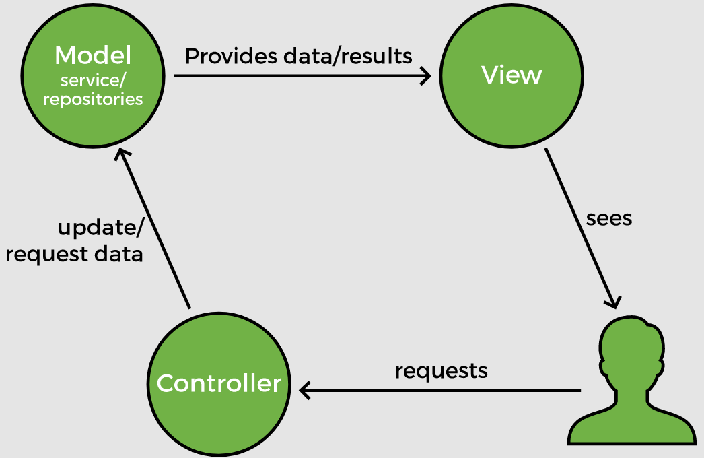

# Lesson 5: Comparing Spring Boot and Spring MVC

## Overview

Spring offers the __Spring MVC__ framework for developing web applications. What is the difference between __Spring Boot__ and __Spring MVC__? Which one should be used for developing web applications? Both __Spring Boot__ and __Spring MVC__ play a separate role and both are designed to solve different problems.

## Demonstrated Concepts

### Spring framework

__Spring Boot__ and __Spring MVC__ are both components of the __Spring__ framework. Spring offers dependency injection and inversion of control, which provides good integration with other frameworks. It defines beans using different annotations and autowires them. Spring helps build loosely coupled applications that are easy to unit test. It also eliminates plumbing code like exception handling, establishing and closing connections, etc.

### Spring MVC

__Spring MVC__ is an HTTP oriented Spring framework, which is concerned with developing web applications. It makes use of the Model View Controller (MVC) design pattern to achieve separation of concerns.

The Dispatcher Servlet is the front controller that handles all requests while the View Resolver is concerned with resolving view names to physical views. This decoupling makes development of web applications and RESTful services very simple because the model, view, and controller operate without dependency. 

When we built a web service with Spring Boot, it internally made use of Spring MVC. Spring MVC helps create web applications that are scalable as well as testable.

### Spring Boot

__Spring Boot__ is designed to solve configuration issues. It autoconfigures a lot of dependencies based on the kind of application that is being built. Spring Boot offers pre-configured projects to bootstrap an application in a few simple steps. When building a web application using Spring Boot, the Dispatcher Servlet, View Resolver, Data Source, Transaction Manager, etc. get configured automatically. Spring Boot configures compatible versions of the dependencies needed for the frameworks. Moreover, it also provides monitoring features.

Spring Boot helps kickstart the project by bringing in all the required dependencies. It is a useful tool for someone who is just starting out with Spring and gets overwhelmed with the configuration part. It also saves a lot of time. However, Spring Boot offers a biased view and has strong preferences about the dependencies that are used.