# Lesson 13: Spring Data REST

## Overview

__Spring Data REST__ is a project similar to __Spring Data JPA__ which aims to eliminate boilerplate code and allows us to get the basic CRUD functionality without writing any code simply by specifying the entity and the type of primary key.

Similarly, Spring Data REST provides a REST API based on the repository and entity without us having to write any code in the controller and service layer. It uses the repository to expose endpoints to perform `GET`, `POST`, `PUT`, `PATCH` and `DELETE` on every entity in the application. Spring Data REST works with data sources implementing the repository programming model. It supports Spring Data JPA, Spring Data MongoDB, Spring Data Cassandra as well as other Spring Data projects.

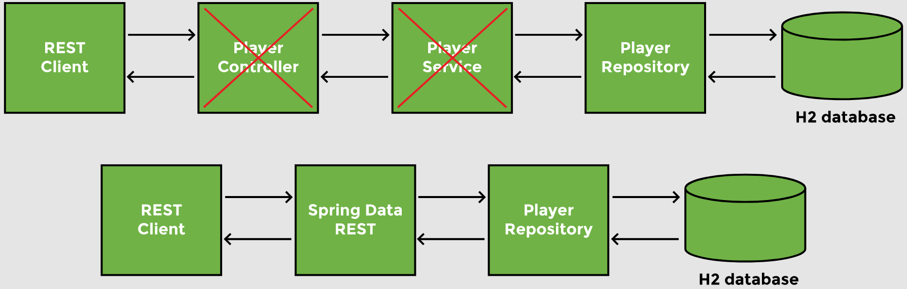

Spring Data REST provides a basic REST API which can be customized. Custom queries can be added using JPQL and Query DSL.

Spring Data REST creates endpoints using the entity name by making the first letter _lowercase_ and adding an ‘s’ to the end of the name. 

For example, we have the following repository interface:

```java
public interface PlayerRepository extends JpaRepository<Player, Integer> { 

}
```

Spring Data REST will convert the entity name `Player` to its _uncapitalized_, _pluralized_ form `players` and expose the REST endpoints at `/players`. It also exposes `/players/{id}` for each item managed by the repository.

To create a Spring Data REST application using Spring Boot, we need:

- `spring-boot-starter-data-rest` dependency in `pom.xml`
- An entity (e.g., `Player`)
- A repository interface (e.g., `JpaRepository` or `CrudRepository`)

## Demonstrated Concepts

### Dependencies

The following dependencies are used in this project

- Spring Data JPA `spring-boot-starter-data-jpa`
- REST Repositories `spring-boot-starter-data-rest`
- H2 Database `h2`
- Spring Boot Devtools `spring-boot-devtools`

To add the Spring Data Rest functionality to an existing project, add the following dependency to the `pom.xml` file:

```xml
<dependency>
    <groupId>org.springframework.boot</groupId>
    <artifactId>spring-boot-starter-data-rest</artifactId>
</dependency>
```

### Define entity

Spring Data REST scans the repositories to create the endpoints based on the entities defined.

In our project, `Player` is the entity. `Player` is annotated with the `@Entity` annotation so it will be marked by the JPA.

The `Player` entity has different fields. `id` is the primary key and marked by the `@Id` annotation as well as the `@GeneratedValue` annotation, in which we provide the primary key generation strategy in parentheses.

```java
@Entity
public class Player {
    @Id
    @GeneratedValue(strategy=GenerationType.IDENTITY)
    private int id;
    private String name;   
    private String nationality;
    @JsonFormat(pattern = "dd-MM-yyyy")
    private Date birthDate;
    private int titles;
    //constructors
    //getters and setters
}
```

The in-memory H2 database can be populated using the `import.sql` script placed in the __/src/main/resources__ folder with the following queries:

```sql
INSERT INTO player (ID, Name, Nationality, Birth_date, Titles) VALUES(1,'Djokovic', 'Serbia', '1987-05-22', 81);
INSERT INTO player (ID, Name, Nationality, Birth_date, Titles) VALUES(2,'Monfils', 'France', '1986-09-01', 10);
INSERT INTO player (ID, Name, Nationality, Birth_date, Titles) VALUES(3,'Isner', 'USA', '1985-04-26', 15);
```

On a local machine, the web console of the H2 database is accessed at `http://localhost:8080/h2-console`. 

We set the following properties in the `application.properties` file in __src/main/resources__:

```properties
spring.h2-console.enabled=true
spring.datasource.url=jdbc:h2:mem:testdb
```

> __Note from `ginny100`:__ Since I don't customize the h2 database configuration properties in the `application.properties` file, the information used in the h2-console login page is all default.
> 
> | Field          | Value                 |
> |----------------|-----------------------|
> | Saved Settings | Generic H2 (Embedded) |
> | Setting Name   | Generic H2 (Embedded) |
> | Driver Class   | org.h2.Driver         |
> | JDBC URL       | jdbc:h2:mem:testdb    |
> | User Name      | sa                    |
> | Password       |                       |

### Create repository

The repository `PlayerRepository` extends the `JpaRepository` interface

```java
public interface PlayerRepository extends JpaRepository<Player, Integer> {
    
}
```

At this point, we have the Maven dependency of Spring Data REST, the entity and repository, and we are ready to test our REST API without writing any controller or service classes. 

The application is available at `http://localhost:8080/players` on a local machine and displays the JSON data of the players in the database.

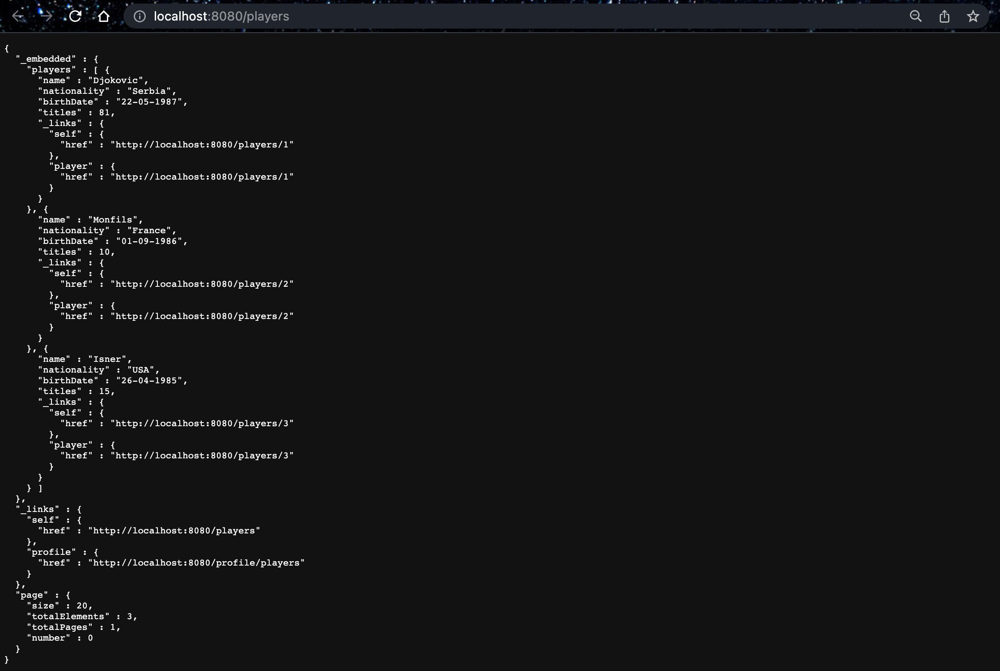

### HATEOAS

Spring Data REST uses the __HATEOAS application architecture__ and provides metadata in the response including the information about the current page, as well as the total number of pages and the number of records per page. This is different from the REST API we created in the previous lessons. 

__HATEOAS__ stands for <b>H</b>ypermedia <b>A</b>s <b>T</b>he <b>E</b>ngine <b>O</b>f <b>A</b>pplication <b>S</b>tate which basically is metadata about the REST data. The server includes _hypermedia_ links in the response and the client can navigate those links to the data. For a collection of items, in addition to the JSON array of items, the metadata information includes the page size and total number of elements etc. 

If you make a `GET` request to `http://localhost:8080/players`, this can be seen in the response:

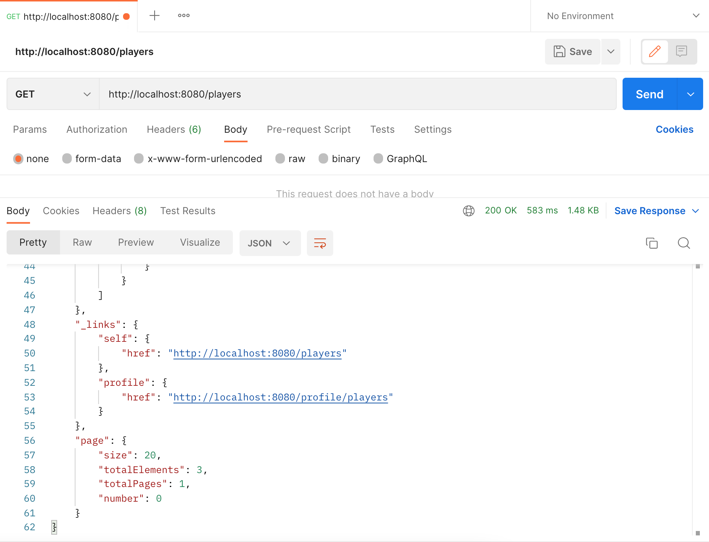

Each item also has a link which can be used to get details of an individual player. If we click the link for _player 2_, a new tab with a `GET` request to `http://localhost:8080/players/2` opens up which shows the JSON response with details of player with `id` 2, as well as the link for the player.

Using Postman, we can __create__ a new player by sending the following JSON data in the request body:

```json
{
    "name": "Federer",
    "nationality": "Switzerland",
    "birthDate": "22-05-1984",
    "titles": 151
}
```

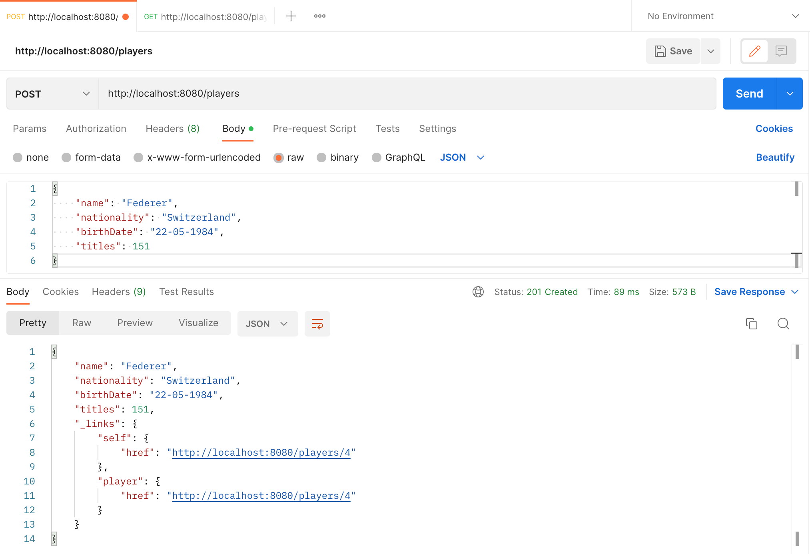

> __Note from `ginny100`:__ I am not sure why, but I actually had to send several `POST` requests in order to successfully add a new player to the database and get the result above.

When we send a `POST` request to `http://localhost:8080/players`, the HATEOAS response shows the hyperlink to the newly created resource (`http://localhost:8080/players/4`). If you click on that link, a new tab with a `GET` request to `http://localhost:8080/players/4` opens so you can try getting the player with `id` 4 from the database.

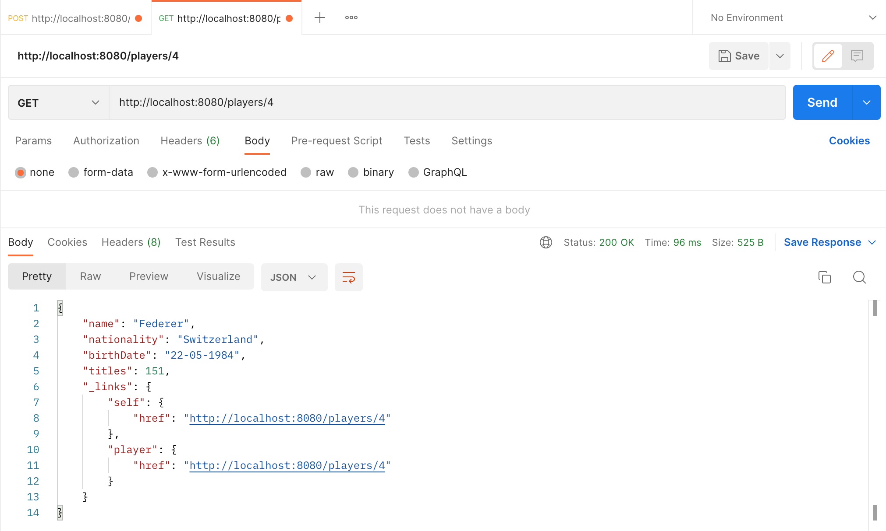

We can also verify that the new player has been added to the database by sending a `GET` request to `localhost:8080/players`.

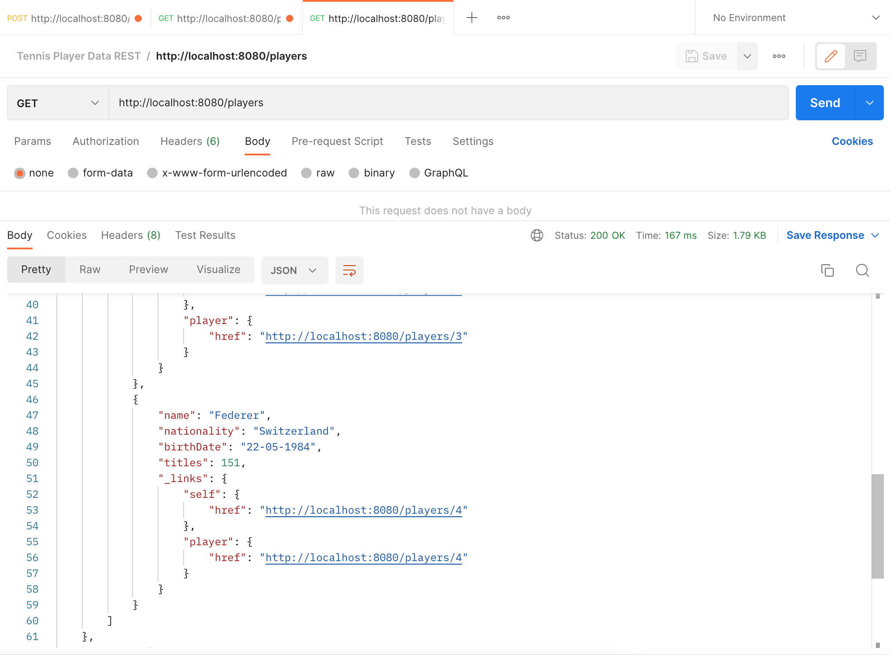

To __update__ a player, send the following `PUT` request to `http://localhost:8080/players/4` with the following JSON data:

```json
{
    "name": "Federer",
    "nationality": "Switzerland",
    "birthDate": "22-11-1984",
    "titles": 161
}
```

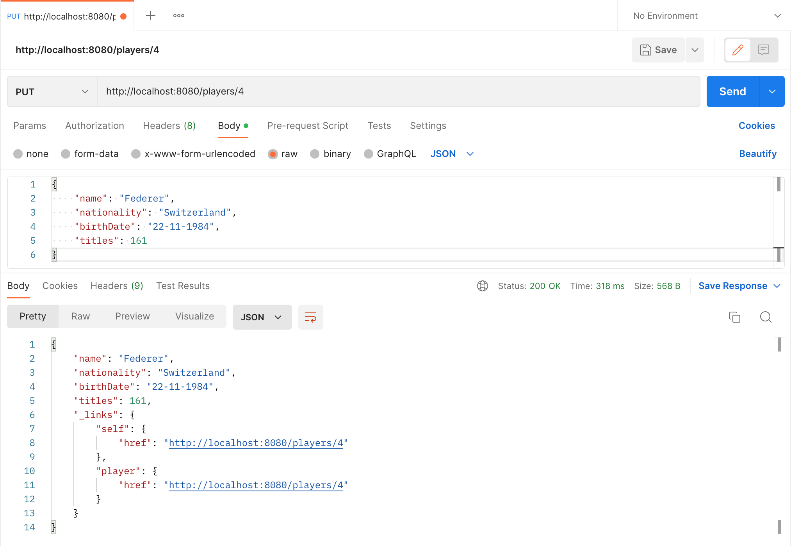

For __partial updates__, we can send a `PATCH` request to `http://localhost:8080/players/1` and update the `titles` to 157.

```json
{
    "titles": 157
}
```

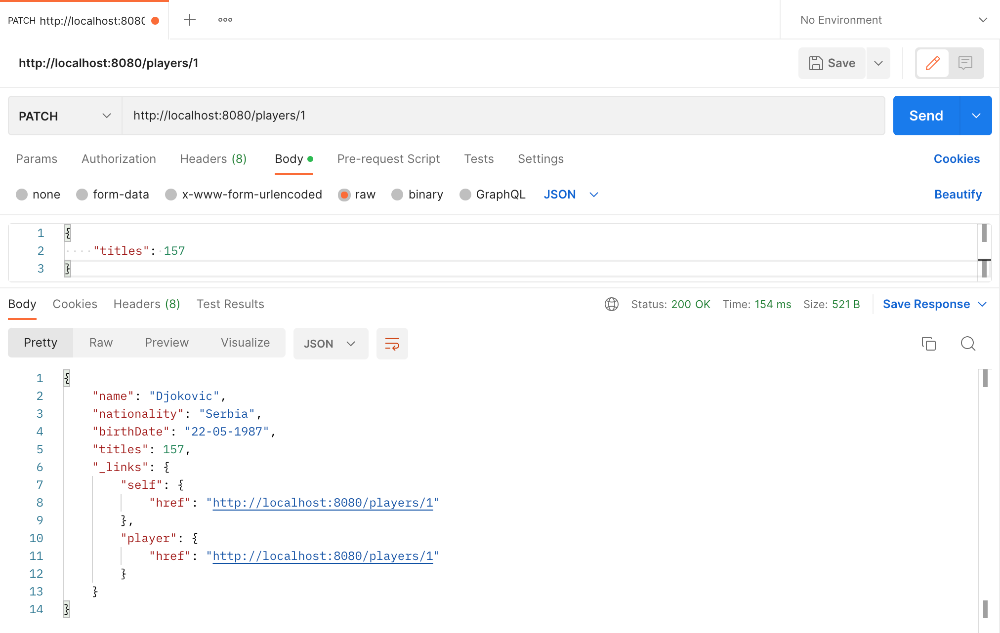

To __delete__ a player, we will send the player `id` in the `DELETE` request to, for example, `http://localhost:8080/players/4`. On success, Spring Data REST response contains status code `204` which stands for no content found.

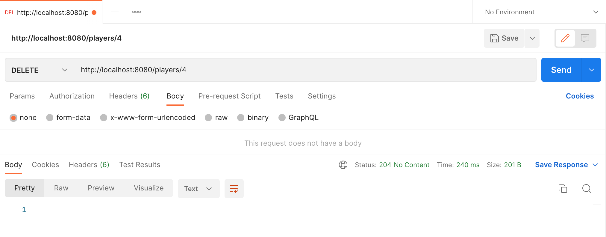

### Customization

Spring Data REST allows for customization of the REST API through a number of properties.

#### Base path

We can change the base path of our API by adding the following property to `application.properties` file:

```properties
spring.data.rest.basePath=/api
```

With this change, the application is available at `http://localhost:8080/api/players` and accessing it at `http://localhost:8080/players` will result in a 404 error.

#### Sorting

We can sort the results returned by the field names of the entity using the sort property in the request URL. 

For example, we can sort the players based on their _date of birth_ by sending a `GET` request to `http://localhost:8080/api/players?sort=birthDate`. The default sort order is ascending.

To sort in descending order, we need to specify the `desc` keyword. A `GET` request to `http://localhost:8080/api/players?sort=titles,desc` will sort the players with the most number of titles on top.

We can also sort by multiple fields, say, `nationality` and `name` as `http://localhost:8080/api/players?sort=nationality,name`.

#### Paging

By default, Spring Data REST returns __20__ records per page. If there are more than 20 records, they are moved to the next page. This default behavior can be changed using properties.

When we send a `GET` request to `http://localhost:8080/api/players`, we get a JSON response of all players and at the bottom, we get the meta-data about the page, which shows that the number of items per page, or size is 20. The metadata also contains information about the total number of elements, and the total number of pages in the response, as well as the current page number. The image below shows the metadata information:

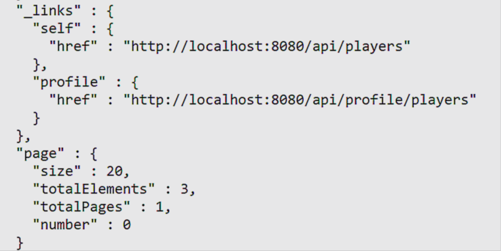

We can use the `defaultPageSize` property and set the items to be displayed per page to 2. That way, we will get a multipage response to the `http://localhost:8080/api/players` request.

```properties
spring.data.rest.defaultPageSize = 2
```

Now, the response will be split in 2 pages, with page 0 being the first page and page 1 being the second page.

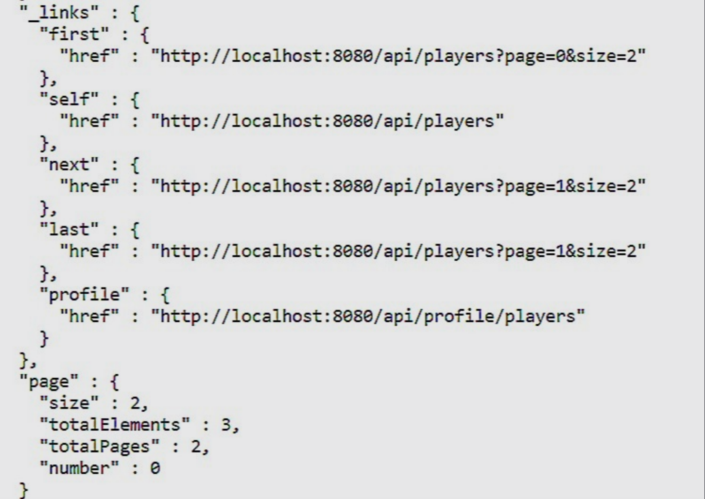

In a multipage response, the metadata also contains links to the __first__ and __last__ pages as well as the previous (__prev__) and __next__ pages of the result. There is no __prev__ link for the first page and no next link for the __last__ page of the response. 

We can navigate to the different pages using the links provided in the response. The page numbering starts at 0. Our database has 3 players and the response contains 2 pages. The second page can be accessed at `http://localhost:8080/api/players/?page=1`.

The page size can also be modified by using the size parameter in the query string. Suppose we want to show 3 elements per page. We can send a `GET` request to `http://localhost:8080/api/players/?size=3`.

#### Resource name

Spring Data Rest uses the _up-capitalized_, _pluralized_ form of the entity name as the resource name for the endpoints. 

From the `Player` entity it created the `/players` endpoint. If we want to change the resource name, we can do so by using the `@RepositoryRestResource` annotation on the repository and provide the desired resource name as path:

```java
@RepositoryRestResource(path="athletes")
public interface PlayerRepository extends JpaRepository<Player, Integer> {

}
```

Spring Data REST will now expose the `/api/athletes` endpoint instead of `/api/players`.
