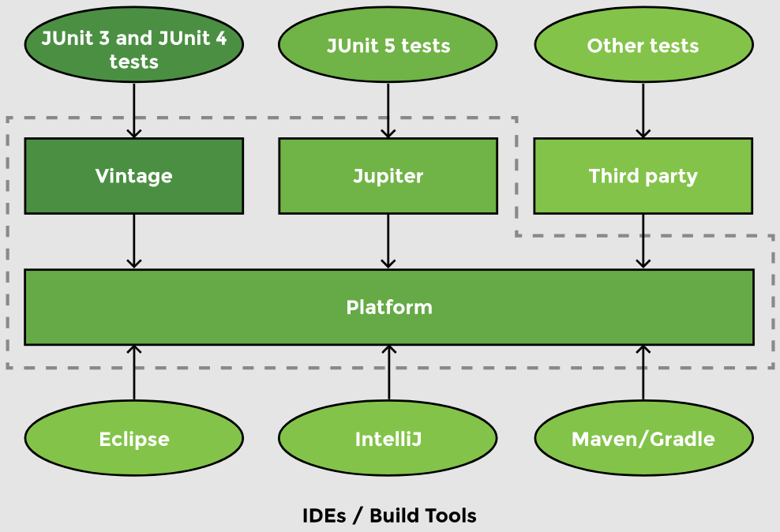

# Lesson 1: JUnit

## Overview

Testing is done at different levels and in different ways.

- __Screen testing/system testing__: Testing an application after deployment
- __Unit testing__: Testing a specific method or a class

__Unit testing__ usually involves writing tests for each method of a class. Unit tests can also be written for a group of methods or to test the whole class.

## Demonstrated Concepts

### JUnit Architecture

__JUnit__ is a popular unit testing framework which automates the testing process so that tests can run continually. If there is a change in the code such that the functionality changes, automated testing will catch it.

JUnit tests compare the _actual output_ to the _expected output_ to check if the code is working correctly and notify the developer if it is not.

JUnit 5 changed the __monolithic architecture__ of JUnit 4 to have separate jar files for the __JUnit platform__ (test engine), __Jupiter__ (JUnit 5 tests), __Vintage__ (JUnit4 tests), and __3rd party extensions__ while also adding support for new testing patterns. Most IDE’s have built-in support for JUnit 5.



JUnit tests are automated meaning that the test can be kept running _any_ number of times. The tests can be run every hour or every time there is a change in the code. The developer is notified whenever a test fails. These tests can be run under __continuous integration__.

### JUnit dependency

To enable JUnit, we need the __JUnit engine__ and the __Jupiter API__ to create tests. When creating a Spring Boot project, JUnit is already included as a dependency. For other cases, the JUnit dependency can be added as follows:

```xml
<dependency>
    <groupId>org.junit.jupiter</groupId>
    <artifactId>junit-jupiter-engine</artifactId>
    <scope>test</scope>
</dependency>
```

`<scope>` specifies where we want the jars to be active. `test` scope means that this dependency will not be included in the final build.