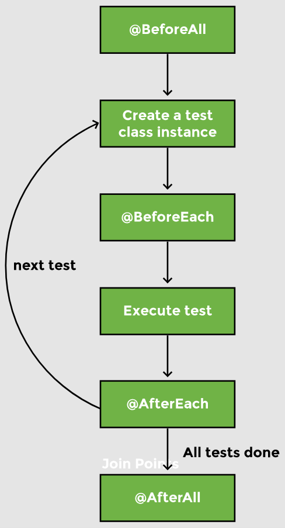

# Lesson 4: JUnit Test Lifecycle Annotations

## Overview

JUnit provides us with some __lifecycle hooks__ that can be plugged in at various places in the test cycle. For example, some initialization code needs to be run _before_ each test, and some cleanup code needs to be run _after_ each test. If we have multiple tests, there might be some code that we want to initialize before any of the tests run. Similarly, there might be some teardown code that we want to run after each test has run.

JUnit Test Lifecycle annotations are `@BeforeAll`, `@AfterAll`, `@BeforeEach`, and `@AfterEach`.



## Demonstrated Concepts

### `@BeforeEach`

A method with the `@BeforeEach` annotation is executed once _before_ every test method executes. We can initialize the objects or establish a database connection before each test in a method annotated with `@BeforeEach`. 

With JUnit, there is _no guarantee_ about the order in which the tests are run. But, it is guaranteed that no matter the order of tests, `@BeforeEach` is run before the test is run.

Example:

```java
@BeforeEach
void init() {
    //Initialize the object here
    System.out.println("Initializing before test"); 
    arrayMethods = new ArrayMethods();
}
```

We need to have the `ArrayMethods` object as a member variable to be able to access its methods in various tests. Even if the object instance is shared by all the test cases, its state is being initialized in the `init` method.

### `@AfterEach`

The `@AfterEach` annotation tells JUnit to run the method _after_ a test has been executed.

Example:

```java
@AfterEach
void afterEachTest(){
    System.out.println("Clean up after test");
}
```

`@AfterEach` on a method ensures that it is run after the test to perform any clean up stuff.

### `@BeforeAll`

A method annotated with `@BeforeAll` is run once _before_ all test methods of the class are executed. It is a setup method and has to be __static__. This method is executed even _before_ the instance of the class to be tested is created.

```java
@BeforeAll
static void beforeAllTests() {
    System.out.println("Run this code before all tests");
}
```

Only a static method can run without being dependent on the class in which it is written.

### `@AfterAll`

The `@AfterAll` annotation on a method ensures that it is run _after_ all the tests have been run. It executes _after_ all test methods of the class are executed. This method is a _class level_ method and is, therefore, __static__.

```java
@AfterAll
static void afterAllTests() {
    System.out.println("Run this code after all tests");
}
```

### Annotations to scale tests

The `@Disabled` annotation disables the test method. 

JUnit engine skips any test methods that have the `@Disabled` annotation on them. This feature is useful for tests that fail because we have yet to implement the logic for the method under test. In such cases, we may want to skip the test for the time being. The developer can write and test the method locally without affecting the overall build output of the application.

```java
@Test
@Disabled
public void testSortArray() {
    fail("unimplemented method");
}
```

We have a `fail` method in the test because we want this test to fail till _all_ the functionality of the method under testing is complete. If the tests are run, the overall build will fail because of the one test that did not succeed. 

If we use the `@Disabled` annotation on this test and run tests again, the overall build will succeed because JUnit skips this test.